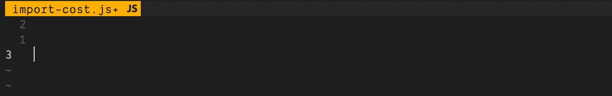

# Import Cost coc.nvim Extension [](https://travis-ci.org/wix/import-cost) [](https://ci.appveyor.com/project/shahata/import-cost)

This extension will display inline in the editor the size of the imported package.
The extension utilizes webpack with babili-webpack-plugin in order to detect the imported size.


## Requirements

This is an extension for [coc.nvim](https://github.com/neoclide/coc.nvim) and requires that it be installed first.

## Installation

Once you have `coc.nvim` installed, open Vim/Neovim, and execute:

```
:CocInstall coc-import-cost
```

## Features

Calculates the size of imports and requires.
Currently supports:

* Default importing: `import Func from 'utils';`
* Entire content importing: `import * as Utils from 'utils';`
* Selective importing: `import {Func} from 'utils';`
* Selective importing with alias: `import {orig as alias} from 'utils';`
* Submodule importing: `import Func from 'utils/Func';`
* Require: `const Func = require('utils').Func;`
* Supports both `Javascript` and `Typescript`

## Why & How

Yair details the Why and How in this blog post:
[https://medium.com/@yairhaimo/keep-your-bundle-size-under-control-with-import-cost-vscode-extension-5d476b3c5a76]()

## Configuration

The following properties are configurable:

```javascript
  // File extensions to be parsed by the Typescript parser
  "importCost.typescriptExtensions": [
    "\\.tsx?$"
  ],

  // File extensions to be parsed by the Javascript parser
  "importCost.javascriptExtensions": [
    "\\.jsx?$"
  ],

  // Which bundle size to display
  "importCost.bundleSizeDecoration": "both",

  // Display the 'calculating' decoration
  "importCost.showCalculatingDecoration": true,

  // Print debug messages in output channel
  "importCost.debug": false
```

## Known Issues

* Importing two libraries with a common dependency will show the size of both libraries isolated from each other, even if the common library needs to be imported only once.
